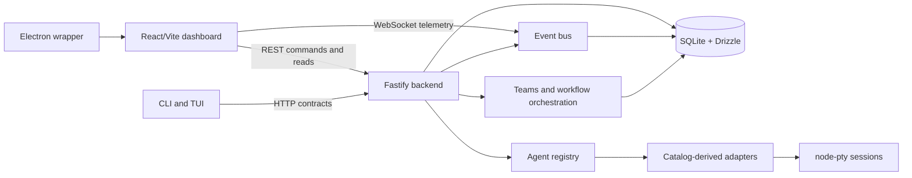

# UTHARNESS OS

UTHARNESS OS is a free, open-source, local-first operating environment for coordinating installed AI agents. The repository is intentionally backend-first: the authoritative application state lives in local SQLite, agent processes are launched only through registered adapters, and REST/WebSocket contracts are implemented before the full desktop and web frontends.

## Current release

Version `0.1.0` provides a working Fastify backend, SQLite migrations, agent discovery, adapter contracts, process-backed sessions, task execution, team coordination, workflow DAG execution, model/provider/MCP registries, memory, permissions, approvals, audit events, a CLI, a compact setup TUI, and a React/Electron frontend shell connected to the real REST and WebSocket contracts. Broader client features remain staged in the roadmap.

## Quick start

```bash
pnpm install
pnpm backend
# in another terminal
pnpm web
pnpm cli doctor
pnpm cli agents scan
pnpm test
pnpm typecheck
pnpm build
```

The React shell is available at the Vite development URL, and the Electron wrapper loads the same renderer against the local backend:

```bash
pnpm web
pnpm desktop
```

Frontend architecture and runtime configuration are documented in [docs/FRONTEND.md](docs/FRONTEND.md). The complete operator walkthrough is available in [docs/GETTING_STARTED.md](docs/GETTING_STARTED.md).

## Installation

UTHARNESS OS is currently installed from source. It is designed for a local operator, so no cloud account or hosted service is required for the default workflow. For a detailed matrix covering npm, npx, pnpm, pnpx, Yarn, Bun, bunx, Deno, uv, uvx, pip, pipx, Python, Cargo, Homebrew, apt, Nix, Volta, mise, fnm, nvm, Corepack, Rush, Lerna, cnpm, curl, and Git, read [Installation methods](docs/INSTALL_METHODS.md).

| Requirement      | Supported baseline                                                                | Check            |
| ---------------- | --------------------------------------------------------------------------------- | ---------------- |
| Node.js          | 22 or newer                                                                       | `node --version` |
| pnpm             | 11.21.0, as declared by the workspace                                             | `pnpm --version` |
| Git              | A recent version                                                                  | `git --version`  |
| Operating system | Linux, macOS, or Windows for the workspace; Electron follows its platform support | —                |

Clone the public repository and install the workspace dependencies:

```bash
git clone https://github.com/senkamaniskeny/utharness-os.git
cd utharness-os
pnpm install
```

Start the local backend in one terminal. It binds to `127.0.0.1:4317` by default and creates `./data/utharness.sqlite` on first use:

```bash
pnpm backend
```

In a second terminal, start the React dashboard:

```bash
cd utharness-os
pnpm web
```

Open the Vite URL printed in the terminal, normally [http://127.0.0.1:5173](http://127.0.0.1:5173). The dashboard reads durable state from the REST API and subscribes to the local WebSocket stream at `ws://127.0.0.1:4317/ws`.

For the Electron development shell, keep the backend running and launch the combined web/Electron development command from the repository root:

```bash
pnpm --filter @utharness/desktop dev
```

For a production-like local Electron launch, build the workspace first and then start the wrapper:

```bash
pnpm build
pnpm desktop
```

## First run

After the dashboard opens, select **Agents** in the sidebar and choose **Detect installed** to scan local executables. For an allowlisted npm or Python tool, use **Install** and monitor the bounded installer output in the progress surface. For tools that require their own official setup, use **Setup guide** to open the official site, documentation, source repository, and any catalog-provided installation note. Select a detected local CLI tool, configure its working directory and optional model, and use **Open chat** to launch a PTY-backed session.

The CLI and setup TUI can be used without the web shell:

```bash
pnpm cli --help
pnpm cli --version
pnpm cli doctor
pnpm cli status
pnpm cli config
pnpm cli agents scan
pnpm tui
```

To install and verify the actual CLI executable outside the development tree, build and pack the CLI, then install its tarball globally:

```bash
mkdir -p artifacts
pnpm build
pnpm --filter @utharness/cli pack --pack-destination artifacts
npm install --global ./artifacts/utharness-cli-0.1.0.tgz
utharness-os --help
utharness-os --version
utharness-os status
```

The package provides both `utharness-os` and `utharness` command names. Set `UTHARNESS_URL` when the backend runs on a non-default local port; `utharness-os config` prints non-secret runtime settings for troubleshooting.

Run the repository validation suite before making changes or packaging a local build:

```bash
pnpm typecheck
pnpm test
pnpm lint
pnpm build
```

## Local configuration

The server binds to `127.0.0.1:4317` by default and stores state in `./data/utharness.sqlite`. Set the following variables before starting the relevant process when a different local layout is required:

| Variable                 | Purpose                                                    | Example                                        |
| ------------------------ | ---------------------------------------------------------- | ---------------------------------------------- |
| `UTHARNESS_DB`           | SQLite database path or `:memory:` for deterministic tests | `UTHARNESS_DB=/tmp/utharness.sqlite`           |
| `UTHARNESS_HOST`         | Backend bind host; loopback is the safe default            | `UTHARNESS_HOST=127.0.0.1`                     |
| `UTHARNESS_PORT`         | Backend HTTP/WebSocket port                                | `UTHARNESS_PORT=4317`                          |
| `UTHARNESS_RATE_LIMIT`   | Requests per time window for local API rate limiting       | `UTHARNESS_RATE_LIMIT=1000`                    |
| `UTHARNESS_URL`          | Backend URL used by the CLI                                | `UTHARNESS_URL=http://127.0.0.1:4317`          |
| `VITE_UTHARNESS_API_URL` | REST base URL baked into a Vite web build                  | `VITE_UTHARNESS_API_URL=http://127.0.0.1:4317` |
| `VITE_UTHARNESS_WS_URL`  | WebSocket URL baked into a Vite web build                  | `VITE_UTHARNESS_WS_URL=ws://127.0.0.1:4317/ws` |
| `UTHARNESS_WEB_URL`      | Development renderer URL used by Electron                  | `UTHARNESS_WEB_URL=http://127.0.0.1:5173`      |

Example isolated backend startup:

```bash
UTHARNESS_DB=/tmp/utharness.sqlite UTHARNESS_PORT=4317 pnpm backend
```

The backend is intentionally localhost-only. Do not set `UTHARNESS_ALLOW_REMOTE=1` unless the service is placed behind an authenticated, encrypted, and rate-limited reverse proxy with an explicit threat model. Read [SECURITY.md](SECURITY.md) before exposing any non-loopback interface.

## Troubleshooting

If the dashboard reports that the REST or WebSocket stream is offline, confirm that `pnpm backend` is still running and that the web build’s `VITE_UTHARNESS_API_URL` and `VITE_UTHARNESS_WS_URL` point to the same backend port. If an agent is not listed after installation, run **Detect installed** again or execute `pnpm cli agents scan`; the operator must install and trust the executable before discovery can report it. If an interactive CLI fails to open, verify its executable is on the PATH visible to the backend process and that its working directory exists.

For API routes and event envelopes, see [API.md](API.md). For the frontend shell and Electron security model, see [docs/FRONTEND.md](docs/FRONTEND.md). For source-install details and local security notes, see [INSTALL.md](INSTALL.md) and [SECURITY.md](SECURITY.md).

## Backend contracts

REST endpoints are rooted at `/api`, and the event stream is available at `ws://127.0.0.1:4317/ws`. A concise route and event reference is in [API.md](API.md). Every mutating route validates input with Zod, writes authoritative state to SQLite, and emits an event where the domain operation is observable.

## Security posture

The default posture is local-only access, strict request validation, rate limiting, no arbitrary shell execution, explicit process permission checks, audit logging for permission changes, bounded request bodies, secret-safe environment merging, and SQLite foreign-key enforcement. See [SECURITY.md](SECURITY.md) before enabling remote access or registering an agent with elevated capabilities.

## Repository structure

| Area                       | Purpose                                                                            |
| -------------------------- | ---------------------------------------------------------------------------------- |
| `apps/backend`             | Fastify REST/WebSocket server and domain services                                  |
| `apps/cli`                 | `utharness-os` / `utharness` command-line client                                   |
| `apps/tui`                 | Interactive setup and diagnostics surface                                          |
| `apps/web`                 | React/Vite operations dashboard connected to REST and WebSocket contracts          |
| `apps/desktop`             | Electron wrapper with isolated renderer and preload bridge                         |
| `packages/frontend-client` | Browser-safe typed REST client and reconnecting event stream                       |
| `packages/*`               | Planned reusable domain packages, scaffolded for extraction as contracts stabilize |
| `integrations/*`           | Adapter-specific integration slots                                                 |
| `migrations`               | Human-readable migration notes and future migration assets                         |
| `.github/workflows`        | CI, security, release, and publishing automation                                   |

## Architecture overview

UTHARNESS OS is organized as a backend-first monorepo. The backend owns durable state and process authority; every client is a projection or command surface over the REST and WebSocket contracts. This boundary keeps browser state disposable and makes the local SQLite database the source of truth for sessions, agents, tasks, teams, workflows, permissions, approvals, memory, telemetry, and audit records.



| Layer                          | Location                                                                 | Responsibility                                                                                                | Contribution boundary                                                                                                                 |
| ------------------------------ | ------------------------------------------------------------------------ | ------------------------------------------------------------------------------------------------------------- | ------------------------------------------------------------------------------------------------------------------------------------- |
| HTTP and event contract        | `apps/backend/src/server.ts`                                             | Fastify routes, validation, CORS, rate limiting, WebSocket upgrade, and event fan-out                         | Add or change a route only with validation, persistence, an event decision, and integration coverage.                                 |
| Persistence                    | `apps/backend/src/database.ts`                                           | SQLite connection, WAL mode, schema bootstrap, migrations, and typed resource access                          | Keep durable state in SQLite; do not make a browser store or event stream authoritative.                                              |
| Runtime authority              | `apps/backend/src/runtime.ts` and `apps/backend/src/terminal.ts`         | Agent discovery, permissions, sessions, PTY/child-process fallback, terminal lifecycle, and event publication | Treat process launch and input as privileged operations; preserve permission and audit checks.                                        |
| Agent catalog and installation | `apps/backend/src/agent-tools.ts`, `agents.ts`, and `agent-installer.ts` | Official tool metadata, adapter detection, allowlisted npm/Python installation, and durable installer jobs    | Extend the catalog with official source metadata and explicit installer policy; never accept arbitrary install commands from clients. |
| Orchestration                  | `apps/backend/src/orchestration.ts`                                      | Teams, mailbox messages, task coordination, and workflow DAG execution                                        | Persist state transitions and publish observable events for long-running operations.                                                  |
| Browser client                 | `packages/frontend-client`                                               | Typed REST helpers and reconnecting WebSocket event stream                                                    | Keep browser-facing contract types aligned with backend responses and avoid server-only dependencies.                                 |
| Operations dashboard           | `apps/web`                                                               | React module surfaces, Liquid Glass/HUD design system, selectors, forms, and telemetry presentation           | Use shared design tokens and handle loading, empty, error, responsive, and reconnect states.                                          |
| Desktop shell                  | `apps/desktop`                                                           | Hardened Electron `BrowserWindow`, preload bridge, and renderer loading                                       | Keep `contextIsolation`, sandboxing, and disabled Node integration enabled; expose only deliberate capabilities.                      |
| CLI and TUI                    | `apps/cli`, `apps/tui`                                                   | Terminal diagnostics, discovery, and setup surfaces over local contracts                                      | Prefer existing API contracts instead of duplicating backend business logic.                                                          |

### Runtime data flow

A mutating user action starts in the dashboard, CLI, TUI, or desktop renderer and reaches a validated Fastify route. The route delegates to a backend service, writes the authoritative result to SQLite, and publishes a typed event when the operation is observable. WebSocket clients receive the event for immediate telemetry, while the client refreshes REST state for durable truth. This means a reconnect, browser refresh, or second client converges on the same local database state.

Agent sessions follow a stricter path. The catalog identifies a registered executable, the registry verifies detection, the session manager applies permissions and environment rules, and the PTY manager launches the process. Session output is published as events and persisted where the relevant domain requires it. A client must not bypass the registry by sending an arbitrary executable path to a session route.

### Contributor workflow

Start by identifying the contract-owning backend module and the client surface that consumes it. For a new domain operation, add the validated route, persistence behavior, event behavior, and backend integration test before wiring the React interaction. For a UI change, cover loading, empty, error, success, and narrow viewport states, then run the browser smoke checks when the interaction touches the live dashboard. Keep security-sensitive changes local-first by default and update [SECURITY.md](SECURITY.md) when the trust boundary changes.

Before opening a pull request, run the repository checks from the root:

```bash
pnpm typecheck
pnpm test
pnpm lint
pnpm build
```

The CI matrix also runs a fresh-runner installation smoke test that installs the frozen lockfile, builds the workspace, starts the backend against a temporary SQLite database, checks `/api/health`, and exercises the CLI against that newly started backend. The workflow is in [.github/workflows/install-smoke.yml](.github/workflows/install-smoke.yml), and its portable runner logic is in [scripts/ci-install-smoke.mjs](scripts/ci-install-smoke.mjs).

## License

UTHARNESS OS is released under the MIT License. See [LICENSE](LICENSE).
